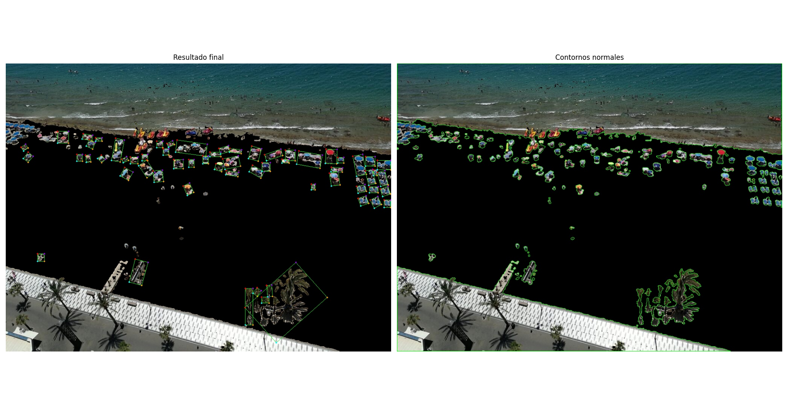
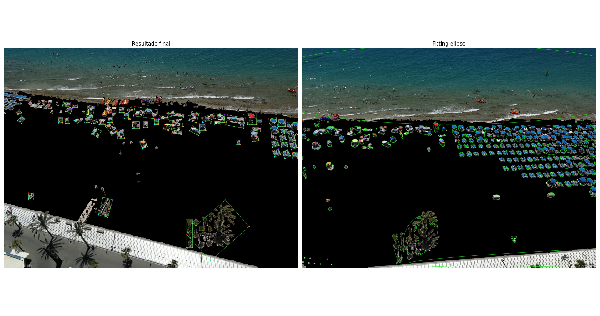

# Resultados de la detección de nucleos de las imagenes de la playa
A continuación se pueden observar los resultados de la segmentacion de las imagenes tomadas en altura desde diversas terrazas y hoteles de benidorm. Estas imagenes presentan en menor medida el problema que se ha planteado a lo largo del proyecto que es la perspectiva de la imagen la cual no nos permite detectar de manera real que nucleos se encuentran en dicha imagen. En los siguiente resultados podemos observar lo obtenido usando técnicas como mask operaciones morfologicas, etc... Para poder elimnar la arena y mantener los elementos que nos interesan para dicha detección

## Resultados contornos normales
En la carpeta [Contornos_Normales](./Contornos_Normales/) podemos observar los resultados de la detección contornos con diferentes tamaños de apertura y cierre. A continuación se comentan los resultados obtenidos con las técnicas utilizadas y los contornos detectados con findContours de OpenCV.

- ``` 1_beni.jpg ``` : Los mejores resultados obtenidos con los contornos normales y varios tamaños de apertura y cierre ha sido entre los tamaños 15 y 20 se encontraría el mejor resultado ya que resultados inferiores se encontraría mucho ruido y resultados superiores se perderían muchos nucleos.
- ``` 2_beni.jpg ``` : Los mejores resultados obtenidos con los contornos normales y varios tamaños de apertura y cierre ha sido entre los tamaños 15 y 20 se encontraría el mejor resultado ya que resultados inferiores se encontraría mucho ruido y resultados superiores se perderían muchos nucleos.
- ``` 3_beni.jpg ``` : Los mejores resultados obtenidos con los contornos normales y varios tamaños de apertura y cierre ha sido entre los tamaños 5 y 10 se encontraría el mejor resultado ya que resultados inferiores se encontraría mucho ruido y resultados superiores se perderían muchos nucleos.

## Resultados otras pruebas de contornos
### Convex Hull
En la carpeta [Convex_Hull](./Convex_Hull) podemos apreciar los resultados con dicha técnica para los contornos que se encuentra explicado en [explicacion_comparativa.md](./Convex_Hull/explicacion_comparativa.md). Donde se puede concluir que para nuestro caso no se encuentran mejoras con este metodo.

### Bounding rectangle
En la carpeta [Bounding_Rectangle](./Bounding_Rectangle) podemos apreciar los resultados con dicha técnica para los contornos que se encuentra explicado en [explicacion_comparativa.md](./Bounding_Rectangle/explicacion_comparativa.md). Se concluye que en el uso de un rectangulo para los contornos se podría utilizar en algunos casos.

### Minimum Enclosing Circle
En la carpeta [Minimum_Enclosing_Circle](./Minimum_Enclosing_Circle) podemos apreciar los resultados con dicha técnica para los contornos que se encuentra explicado en [explicacion_comparativa.md](./Minimum_Enclosing_Circle/explicacion_comparativa.md). Podría utilizarse en algun caso aunque el resultado es peor que findcountours y posteriormente dibujandolos además de presentar unas formas similar, en el caso que hemos probado se ve gran error al haber circulos muy grande en mitad por el posible ruido en las detecciones.

### Fitting elipse
En la carpeta [Fitting_Elipse](./Fitting_Elipse) podemos apreciar los resultados con dicha técnica para los contornos que se encuentra explicado en [explicacion_comparativa.md](./Fitting_Elipse/explicacion_comparativa.md). Dada la perspectiva los resultados son algo mejores que con los circulos pero sigue sin estar a la altura de findcontours. Aunque en algunos caso con otra perspectiva podría llegar a ser util.

### Countour Aproximation
En la carpeta [Countour_Aproximation](./Countour_Aproximation) podemos apreciar los resultados con dicha técnica para los contornos que se encuentra explicado en [explicacion_comparativa.md](./Countour_Aproximation/explicacion_comparativa.md). Es la segunda mejor opción pero finalmente se utilizó otro metodo. Este metodo se podría profundizar mas ajustado en valor de epsilon.

## Resultado final detección de nucleos
Finalmente para la detección de contornos de una manera precisa se ha utilizado el metodo de findcontours de OpenCV además de funciones de la librería Imutils para ordenar los contornos de derecha a izquierda para posteriormente ordenar los cuatro puntos que van a definir el contorno de una manera precisa que además se pueden utilizar para calcualr las distancías entre ellos. Previo al proceso se descartan los contornos de un tamaño muy grande y un tamaño muy pequeño para eliminar ruido y contornos que no nos interesan.

Además de realizar la numeración de los mismos para poder identificarlos de una manera mas sencilla en el caso que fuera necesario.


Estos resultados se pueden observar en la carpeta [Final_detection](./Final_detection) donde se encuentran los resultados de las imagenes de la playa de Benidorm.

## Comparativa de resultados
A continuación se muestran las comparativas entre cada uno de los resultados, la cuales también se pueden ver en la carpeta [Comparativa](./Comparativas).
#### Final vs normales

#### Final vs Convex Hull

#### Final vs Bounding Rectangle

#### Final vs Minimum Enclosing Circle

#### Final vs Fitting Elipse

#### Final vs Countour Aproximation


